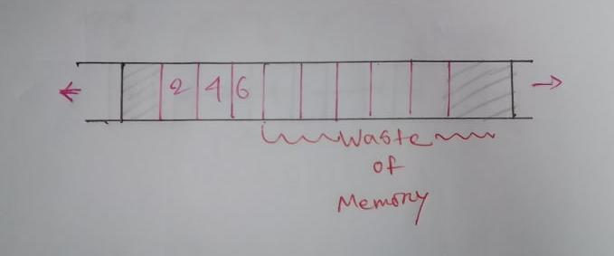

# 00 Linked List

Created: 02-09-2021 15:40     
Home: [Index](../README.md)      
Previous: [Index](../README.md)     
Next: [01 Singly Linked List](01%20Singly%20Linked%20List.md)    
Source: [mycodeschool (1-4)](https://www.youtube.com/playlist?list=PL2_aWCzGMAwI3W_JlcBbtYTwiQSsOTa6P)

---

## Let's first talk about lists 😃

Lists are very common in our life. We use them everyday for making grocery list, book list, student list, employee list and what not.   

The list we use may perform these: 
- Storing information.
- Writing/modifying information.
- Reading information. 
- Deleting information. 


We have been using `Arrays` to make list and perform the above operations for a while. Though `arrays` are very useful and easy to implement, they are not very handy in certain cases. 

Let's first define our list a more broadly. We can have 2 types of list, **static** and **dynamic**. Static lists are those that are fixed and we can not stretch them into a bigger one. Dynamic list can be made into bigger ones at runtime. 

#### Static Lists:

- Can store a certain type of value at a certain position. 
- Write/modify element at a position.
- Read element of a position.
- Delete element of a position.


We can perform the above operations using `arrays` with no sweat at all. The best part, it will take `constant time` to do all the above operations. Because, `arrays` are stored at a continuous memory location and we can access them using index number, like this `arr[0]`. So,  Time complexity here will be `O(1)`.


But if we add some more features into that list then it becomes much complex and tedious to implement it with `arrays`.

#### Dynamic Lists:

- Insert a data.
- Remove a data.
- Write/modify a data.
- Read data.
- Add data.


We can try to implement the above functionality with `arrays` too. It's possible. But it's not the best solution. Why? 

Accessing a data (reading/writing) will take constant time as before. Time complexity `0(1)`.

**Insertion:** Inserting at the end of the list will always take time proportional to the `size of the array`. Because, we will have to traverse the entire `array` for insertion. Time complexity `0(n)`.


Inserting at a given position will also take time proportional to the `size of the array` because we will have to shift the other values one position to the left. Time complexity `0(n)`.


**Deletion:** Deleting also takes time proportional to the `size of the array` because we will have to shift the other values one position to the right. Time complexity `0(n)`.


**Add:** Adding data  will take constant position if the `array` is not full else we have to make a new `array` with larger size then copy this `array` to the new one and then add the value. Which again takes time proportional to the `size of the array`. Time complexity `0(n)`.


**So, what is the problem here ?**

Well, the problem is with the declaration of `arrays`. `Arrays` are very static in nature. We have to tell the size of the `array` in the time of declaration. So, we can't properly make it dynamic. If we do so it'll waste a lot of memory. 

What I mean is, as we don't know the `array` size we try to make an `array` by guessing the size. But later we use only a small portion of it and the rest of the memory stays unused and therefore not efficient. 

```c++
int arr[100]; //guessing array size is 100

//later using only 5 elements from array
arr[0] = 1; arr[1] = 2; arr[2] = 3; arr[3] = 4; arr[4] = 5;

// so the rest of the array goes unused
```

Also, when we delete a data we don't delete the entire `array` or reduce the `size of the array` by one. The `array` stays the same.

So, we are using much memory spaces that we don't even need.



**What's the solution then? **

## Linked List:

To reduce this wastage of memory we use `Linked List`. With `linked list` we can perform the above operations and use memory spaces that we need and free them upon deletion. No wastage of memory and we are all happy. 

`Linked list` is a linear data structure and has two section. One section of the memory store the actual value. And the other one is a pointer pointing to the next element. We call them `nodes`. As, like `arrays` `linked list` doesn't always confirms to be saved in a continuous memory block. It's essential to store the next memory address else we won't be able to access them later. 


`Linked list` usage the `heap` memory section unlike `arrays` which usage the `stack`. `Heap` memory section is completely dynamic in nature. We can define the size of our list at runtime using functions like `malloc(), calloc().` We can also re-allocate memory using `realloc()`. After using the needed memory space we can also de-allocate the memory, free it for someone else to use using `free()`. With `linked list` there is no scope of memory wastage.

we only keep the `head` node information with us when using `linked list`. With the `head` node we access the rest of the nodes i.e information that we stored. 

**Accessing Elements:** It will take time proportional to the `size of the list` because we only have the `head` node unless we are accessing the `head` node itself that will take constant time.

- For `head` node: Time Complexity `O(1)`
- - For other node: Time Complexity `O(n)`


**Insertion:** Insertion at the beginning will take constant time i.e `O(1)` and other places will have time complexity of `O(n)`.


**Deletion:**  Deletion at the beginning will take constant time i.e `O(1)` and other places will have time complexity of `O(n)`.


## `Array` VS `Linked List`

| Operations                   | Array                                                                                                       | Linked List                                                                                                                  |
| ---------------------------- | ----------------------------------------------------------------------------------------------------------- | ---------------------------------------------------------------------------------------------------------------------------- |
| Cost of accessing an element | Constant time. `O(1)`                                                                                       | Time $\propto$ Size of list. `O(n)`                                                                                          |
| Memory requirements          | Fixed Size <br/>->Memory may not be available as one larger block.                                          | Not fixed/ Dynamic<br/>->No unused memory<br/>->Extra memory for pointer<br/>->Memory is not available as a continious block |
| Cost of inserting            | 1. At beginnging = `O(1)`<br/>2. At end = `O(1)`/`O(n)` (if array is full).<br/>3. At n-th postion = `O(n)` | 1. At beginning = `O(1)`<br/>2. At end = `O(1)`<br/>3. At n-th position = `O(n)`                                             |
| Cost of deleting             | Same as insertion                                                                                           | Same as insertion                                                                                                            |
| Ease of use                  | Easier than `Linked List`                                                                                   | Harder than `Arrays`                                                                                                         |


## Disadvantages of `Linked list`:

- Takes more time than arrays.
- Can take more space because of the extra pointer.
	
	```c++
	int arr[3]; // takes 3x4 = 12 bytes
	
	struct node {
	    int n;
		struct node* p;
	}; // for 3 node, (4+4)x3 = 24 bytes
	```


So, that's about it for why we use `Linked list` instead of `arrays`. 

There are 3 types of `Linked list`.
1. [01 Singly Linked List](01%20Singly%20Linked%20List.md)
2. [02 Doubly Linked List](02%20Doubly%20Linked%20List.md)
3. Circular linked list. They are 2 types:
	1. [03 Circular Singly Linked List](03%20Circular%20Singly%20Linked%20List.md)
	2. [04 Circular Doubly Linked List](04%20Circular%20Doubly%20Linked%20List.md)


We will talk about them at their respected pages. See you later 😃.